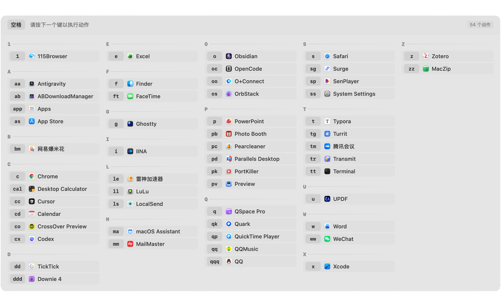
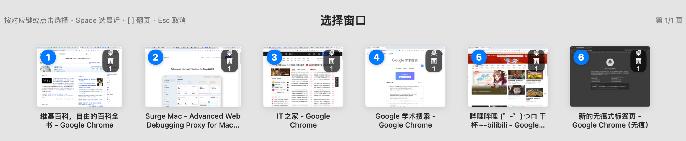
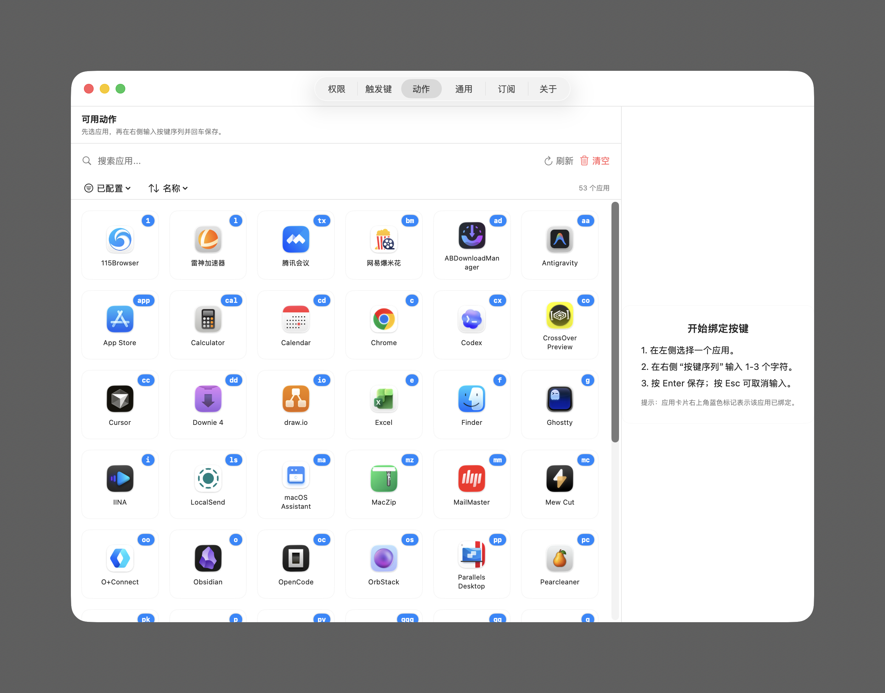

# TelunKey
[简体中文](./README.md) | [繁體中文](./README.zh-Hant.md) | [English](./README.en.md) | [日本語](./README.ja.md) | [한국어](./README.ko.md) | [Español](./README.es.md) | [Português](./README.pt.md) | [हिन्दी](./README.hi.md) | [Русский](./README.ru.md) | [Français](./README.fr.md) | [Deutsch](./README.de.md) | [العربية](./README.ar.md)

TelunKey ist ein nativer macOS-Shortcut-Launcher, mit dem App-Aktivierung und Fensterauswahl in einer Tastenfolge erledigt werden.

- Entwickelt mit nativem Swift für schnelle Reaktion, geringen Overhead und minimale Unterbrechung
- Unterstützt linken/rechten Command (0 Verzögerung oder benutzerdefiniert), linken/rechten Option (0 Verzögerung oder benutzerdefiniert) sowie Space-Trigger (mindestens 0,2 Sekunden Verzögerung, damit normales Tippen nicht beeinträchtigt wird)
- Optimiert für hochfrequente Workflows und flüssigeres Umschalten zwischen Fenstern
- Local-first Design, ohne standardmäßige Abhängigkeit von Cloud-Verhaltensanalysen

## Website

- Zeabur-Homepage: https://telunkey.zeabur.app

> [!IMPORTANT]
> Wenn Sie überhaupt keinen Zugriff auf Zeabur haben, passt TelunKey möglicherweise nicht zu Ihrer aktuellen Umgebung. Wenn Sie Netzwerkprobleme auf Ihrer Seite lösen können, ist TelunKey einen Versuch wert und kann Ihre Effizienz verbessern.

## UI-Vorschau

https://github.com/user-attachments/assets/762f43e0-eac3-4ffa-ba33-f68f720d2627





## Systemanforderungen

- macOS 14.0 oder höher

## Herunterladen

- Neueste Version (DMG): https://github.com/telungit/TelunKey/releases/latest/download/TelunKey.dmg
- Alle Veröffentlichungen: https://github.com/telungit/TelunKey/releases

## Installation

1. Laden Sie „TelunKey.dmg“ herunter und öffnen Sie es
2. Ziehen Sie „TelunKey.app“ in „Anwendungen“.
3. Öffnen Sie die App noch nicht. Doppelklicken Sie zuerst im DMG auf „一键修复.command“.
4. Öffnen Sie TelunKey, sobald die Reparatur abgeschlossen ist
5. Führen Sie den folgenden Befehl nur dann manuell im Terminal aus, wenn das Skript fehlschlägt

```bash
xattr -dr com.apple.quarantine /Applications/TelunKey.app
```

## Berechtigungen

Für die volle Funktionalität benötigt TelunKey die folgenden Berechtigungen:

- Bedienungshilfen: globale Tastaturereignisse erfassen
- Bildschirmaufzeichnung: Fenster-Miniaturansichten generieren

## Datenschutz

TelunKey verfolgt eine Local-First-Strategie. Kerndaten bleiben auf Ihrem Computer.

## Rückmeldung

- Telegram: https://t.me/telungram
